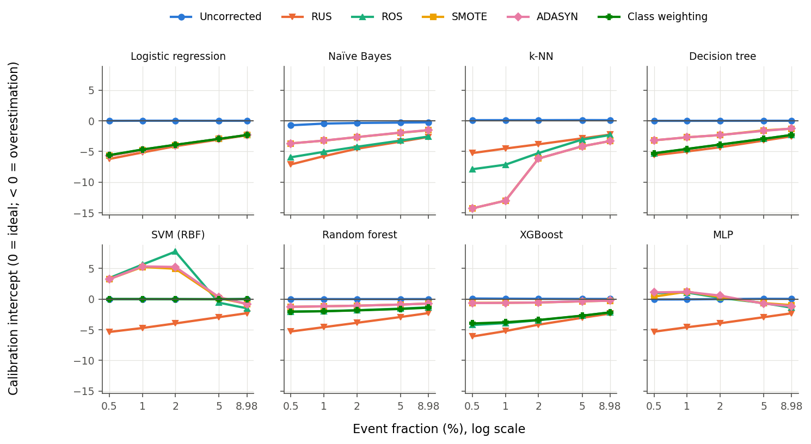
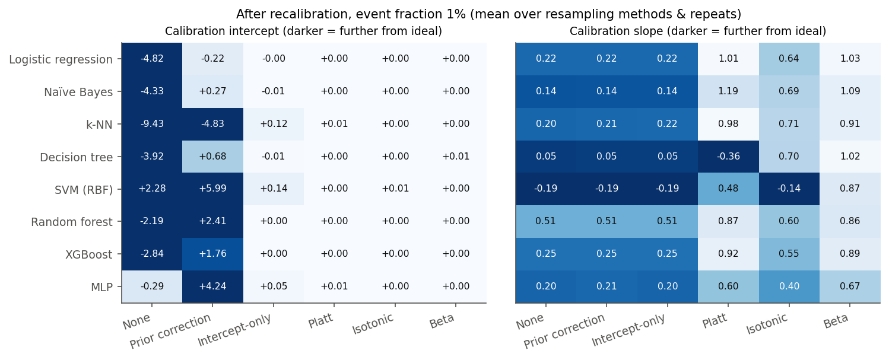
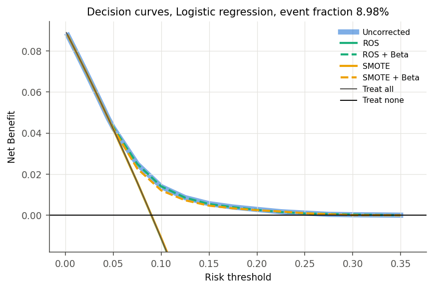

# Risk Estimation Reliability After Class-Imbalance Correction

**Recalibrating machine-learning clinical prediction models under severe imbalance**

Clinical risk models are usually judged by AUROC, but treatment decisions depend on whether a predicted 20% risk really means 20%. Rebalancing the training data with undersampling, oversampling, SMOTE, ADASYN or class weighting changes the event rate the model learns from, so it distorts predicted risks while leaving AUROC largely untouched.

Earlier work showed this harm for logistic regression at event fractions of 1% and above ([van den Goorbergh et al., JAMIA 2022](https://doi.org/10.1093/jamia/ocac093)), and for SVM, random forest and XGBoost at 2% and above ([Carriero et al., Stat Med 2025](https://doi.org/10.1002/sim.10320)). This project extends both studies:

- **Severity:** event fractions down to **0.1%**
- **Repair:** five ways of fixing the damage, not just intercept-only recalibration
- **Clinical utility:** Net Benefit compared against simply moving the decision threshold
- **Data:** a real, high-dimensional hospital dataset (about 170 encoded features)

## Design

| Factor | Levels |
|---|---|
| Data | **Hospital:** Diabetes 130-US Hospitals (UCI #296), 30-day readmission; one encounter per patient (69,990 patients, 8.98% events). **Simulation:** known logistic model, 10 predictors, true AUROC 0.75 |
| Event fraction | Hospital: 8.98% (natural), 5%, 2%, 1%, 0.5%. Simulation: 2%, 1%, 0.5%, 0.2%, 0.1% |
| Imbalance correction | none, random undersampling (RUS), random oversampling (ROS), SMOTE, ADASYN, class weighting |
| Classifier | logistic regression, Naïve Bayes, k-NN, decision tree, RBF-SVM, random forest, XGBoost, MLP (k-NN and SVM are hospital data only) |
| Recalibration | none, analytic prior correction, intercept-only, Platt, isotonic, Beta |
| Repeats | 5 per cell; 11,500 evaluated configurations in total |

Each repeat uses three separate partitions: one trains the classifier, one fits the recalibration map, and one is used only for evaluation. The calibrator never sees the classifier's training predictions.

Metrics:
- **Calibration:** calibration intercept and slope, loess calibration curve, ICI/E50/E90, ECE/MCE, Spiegelhalter's z, Brier score
- **Discrimination:** AUROC and AUPRC
- **Classification:** sensitivity, specificity, PPV and MCC
- **Clinical utility:** Net Benefit from decision curve analysis
- **Simulation only:** error against each patient's true risk

## Key findings

**1. Correction does not improve discrimination.** The median AUROC change was −0.009 on hospital data and −0.002 in simulation.

**2. Correction inflates risk, and the inflation grows as the outcome gets rarer.** Each step down in event fraction makes the median calibration intercept more negative (more overestimation):

| Event fraction | 8.98% | 2% | 0.5% | 0.1% (sim) |
|---|---|---|---|---|
| Median intercept of corrected models | −2.19 | −3.46 | −4.25 | −6.89 |
| Average over-prediction | ~5× | ~17× | ~33× | ~200× |



**3. Oversampling can reverse the error.** SVM and MLP combined with ROS, SMOTE or ADASYN at ≤2% *underestimate* risk (intercepts up to +7.7). Both models validate themselves internally on the training data, and oversampled minority cases end up on both sides of that internal split.

**4. Intercept-only recalibration is not enough.** It fixes the average risk but leaves the slope error untouched: 0.90 at 0.5%. Platt and Beta recalibration fix both.



**5. The analytic prior correction fails outside random resampling.**
- After SMOTE on one-hot hospital data, observed/expected (O/E) was 16 for random forest and 26–27 for XGBoost.
- For random forest after ROS, O/E was 7.9 on hospital data and 74 in simulation, giving a mechanism for the RF + ROS anomaly reported by Carriero et al.

**6. After recalibration, correction buys nothing.** In simulation, the relative error against the true risk at 0.5% was:
- corrected + Beta: 0.574
- uncorrected + Beta: 0.575

**7. Moving the threshold is the better tool.** An uncorrected model with a prevalence threshold matches corrected models' sensitivity and specificity.

Uncorrected miscalibration also destroys clinical utility. At a 10% treatment threshold, Net Benefit per 1,000 patients was:
- uncorrected logistic regression: +13.9
- the same model trained with ROS: −11.2 (worse than treating nobody)



**Recommendation:** train on the natural prevalence, choose the decision threshold from clinical costs, and report calibration alongside AUROC. If a rebalanced model must be used, recalibrate it with Beta or Platt on independent data.

## Reproduce

Requires Python 3.11 or later.

```bash
pip install -r requirements.txt
```

Hospital-data study. The dataset (CC BY 4.0) downloads from UCI on first run. Split the repeats across processes with `--rep-offset`:

```bash
python src/experiment.py --repeats 3 --rep-offset 0 --out results/real_a
```

```bash
python src/experiment.py --repeats 2 --rep-offset 3 --out results/real_b
```

Simulation study:

```bash
python src/experiment.py --dataset sim --repeats 5 --out results/sim
```

Tables, figures and hypothesis summaries, written to `report/real/` and `report/sim/`:

```bash
python src/analyze.py results/real_a results/real_b results/sim --out report
```

A quick check of the pipeline takes about one minute:

```bash
python src/experiment.py --fractions natural 0.01 --classifiers lr xgb --out results/quick
```

The full runs take several hours on a 16-core machine. On Windows, a harmless joblib traceback about `wmic` may appear in the output.

## Repository layout

| Path | Contents |
|---|---|
| `src/data.py` | Cohort construction (hospice/death exclusions, first encounter per patient, ICD-9 grouping), train-only preprocessing, prevalence subsampling, simulation mechanism, UCI download |
| `src/metrics.py` | AUROC/AUPRC, calibration intercept and slope, loess curve, ICI/E50/E90, ECE/MCE, Spiegelhalter's z, Brier, Net Benefit |
| `src/recalibration.py` | Prior correction, intercept-only, Platt, isotonic and Beta recalibration |
| `src/experiment.py` | The factorial experiment |
| `src/analyze.py` | Summary tables, figures and hypothesis checks |
| `results/real_a`, `results/real_b`, `results/sim` | Raw results: one row per configuration (`results.csv`), plus calibration and decision curves (`curves.csv`) |
| `report/real`, `report/sim` | Tables 1–3, figures 1–5 and `hypotheses.txt` |

## Data and key references

- Data: B. Strack et al., "Impact of HbA1c measurement on hospital readmission rates," *BioMed Research International*, 2014, [doi:10.1155/2014/781670](https://doi.org/10.1155/2014/781670). Diabetes 130-US Hospitals dataset, UCI Machine Learning Repository (CC BY 4.0).
- R. van den Goorbergh et al., *JAMIA* 29(9):1525–1534, 2022, [doi:10.1093/jamia/ocac093](https://doi.org/10.1093/jamia/ocac093)
- A. Carriero et al., *Statistics in Medicine* 44(3–4):e10320, 2025, [doi:10.1002/sim.10320](https://doi.org/10.1002/sim.10320)
- M. Piccininni et al., *Journal of Biomedical Informatics* 155:104666, 2024, [doi:10.1016/j.jbi.2024.104666](https://doi.org/10.1016/j.jbi.2024.104666)
- B. Van Calster et al., *BMC Medicine* 17:230, 2019, [doi:10.1186/s12916-019-1466-7](https://doi.org/10.1186/s12916-019-1466-7)
- M. Kull, T. Silva Filho and P. Flach, *Electronic Journal of Statistics* 11(2):5052–5080, 2017, [doi:10.1214/17-EJS1338SI](https://doi.org/10.1214/17-EJS1338SI)
